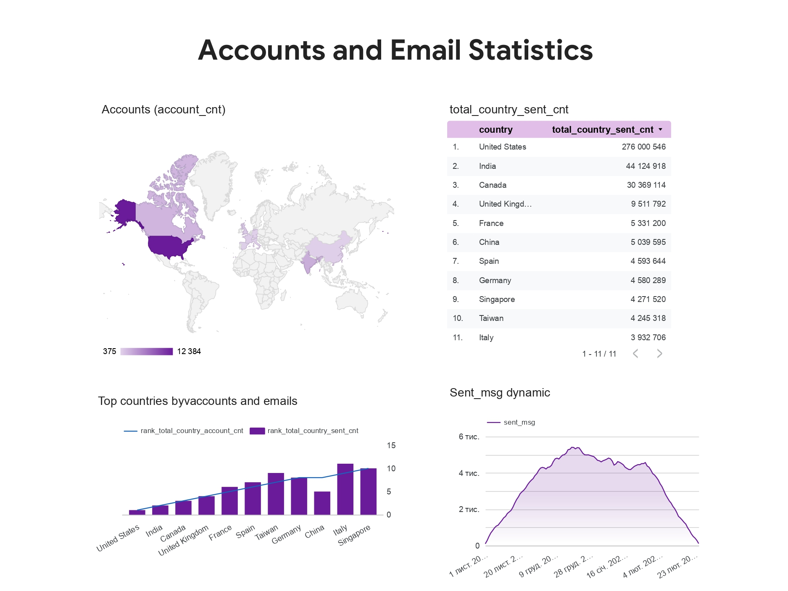

# Email and Account Analytics | SQL

This project focuses on analyzing account creation dynamics and email engagement metrics across multiple dimensions, including country, send interval, verification status, and subscription status. The analysis combines SQL data preparation with a visualization dashboard to explore patterns in user acquisition and email interaction.

### Data Model and Metrics

#### **To analyze account and email activity, I worked with several key dimensions**:

- `date` — account creation date for accounts and email send date for emails
- `country` — user country
- `send_interval` — email sending frequency set by the account
- `is_verified` — account verification status
- `is_unsubscribed` — subscription status

#### **Based on these dimensions, I calculated the following metrics:**

*Primary metrics:*
- `account_cnt` — number of accounts created
- `sent_msg` — number of emails sent
- `open_msg` — number of emails opened
- `visit_msg` — number of email clicks

*Additional Metrics:*
- `total_country_account_cnt` — total number of accounts created per country
- `total_country_sent_cnt` — total number of emails sent per country
- `rank_total_country_account_cnt` — ranking of countries by account creation volume
- `rank_total_country_sent_cnt` — ranking of countries by email sending volume

### SQL Implementation Details

- The query was structured using multiple CTEs to organize the data pipeline and separate different analytical steps.
- First, I built a base dataset by joining session, session parameters, and account tables to connect user sessions with account attributes such as country, send interval, verification status, and subscription status.
- Next, I calculated email engagement metrics by joining this dataset with email activity tables (`email_sent`, `email_open`, and `email_visit`). I used `LEFT JOIN` to preserve emails without opens or visits and `COUNT(DISTINCT id_message)` to prevent duplication.
- Account creation metrics were calculated separately in another CTE to avoid conflicts between account creation dates and email send dates.
- The two datasets were then combined using `UNION ALL`.
- Finally, I applied window functions to calculate country-level totals (`SUM() OVER (PARTITION BY country)`) and rankings (`DENSE_RANK`), and filtered the results to include only the top 10 countries by account creation or email volume.

### Visualization (Looker Studio)
To present the results, I built a dashboard in Looker Studio that summarizes key metrics and trends.

The dashboard includes:
- Country-level totals: `account_cnt`, `total_country_sent_cnt`, `rank_total_country_account_cnt`, `rank_total_country_sent_cnt`
- Dynamics: `sent_msg` trend over time

[Link to results and visualizations](https://docs.google.com/document/d/1SMU6QQruBqSGhsOgy7o4md9fgfrgs255XtM_lYP_Aos/edit?usp=sharing)
